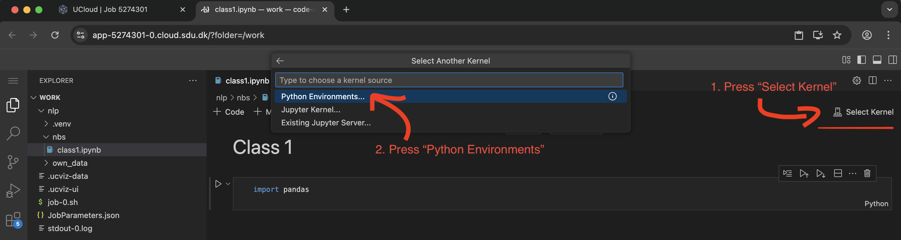
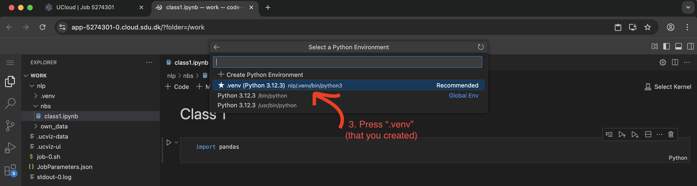
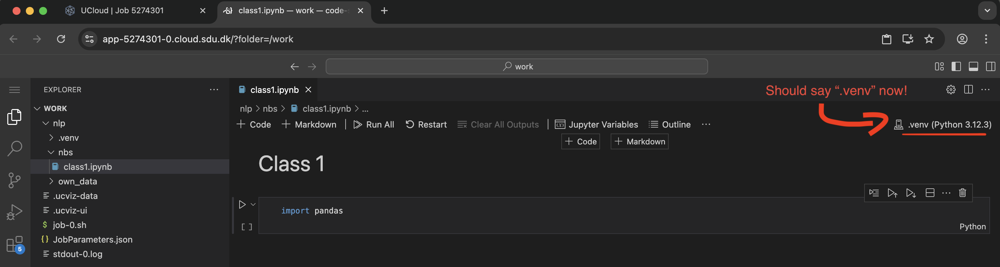
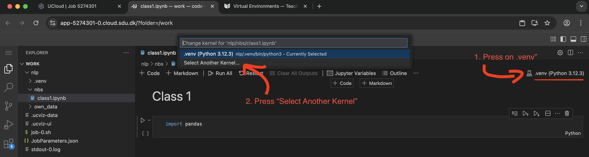

# Virtual Environments 
When we have been running a job on UCloud's *Coder Python*, we have been reinstalling packages for each new run. We can avoid this by using *virtual environments*, which appear as a folder (typically named `.venv`).

This folder contains a seperate Python installation along with any packages you install inside it. In practice, this allows you to have multiple Python versions and package sets on your system without any conflicts:


In addition to improving your UCloud flow, virtual environments are usually created for each coding project. This gives us better control over the packages and their versions (our code's *dependencies*), ensuring the code is **reproducible**.

## Using environments with `venv` 
While there are several ways to use and install virtual environments, this course will using Python's built-in module `venv`.

### Installation
Steps 1-3 only need to be done **once** for every virtual environment you install.

#### Step 1: Change working directory 
In the terminal, navigate to where your code is present:
```bash
cd nlp
```
#### Step 2: Create virtual environment
Type in the terminal:
```bash
python -m venv .venv 
```
```{admonition} Naming your environment
:class: dropdown
In principle, you can call your environment `MyAwesomeEnv`, but the standard practice is to call it `.venv` (or `.env`). This also adheres to GitHub's `.gitignore` template, making it less likely that you will push your environment to Git.
```
#### Step 3: Install `ipykernel` and attach your environment
Do these additional steps to use Jupyter Notebooks with your new `.venv`:

Activate your environment (see [section below](#activate-your-environment) for explanation)
```bash
source .venv/bin/activate
```

Install `ipykernel`:
```bash
pip install ipykernel
```

Navigate to the folder where your notebooks are located
```bash
cd nbs
```

Attach your `.venv`:
```bash
python3 -m ipykernel install --user --name=.venv 
```
### Activate your Environment 
#### In the terminal
If you need to use your `.venv` **in the terminal**:
```bash
source .venv/bin/activate
```
Remember to be located in the same working directory as you created your `.venv`.

```{admonition} Naming your environment
:class: dropdown
If you ended up calling your `.venv` something else (e.g., `MyAwesomeEnv`), you need to adjust this code slightly: 

```bash
source MyAwesomeEnv/bin/activate
```

In UCloud, it should something look like this:
<pre style="background:#1e1e1e;color:#d4d4d4;padding:8px;border-radius:6px;">
<code>
/work/nlp via 🐍 v3.12.3 (.venv)
[11:21:36] ➜ 
</code>
</pre>

#### In Jupyter
To activate your environment for Jupyter, you need to select the kernel in the interface:


Select ".venv":


Should look like this, if it worked:


```{warning}
Activating your `.venv` in Jupyter only works if you have followed [Step 3](#step-3-install-ipykernel-and-attach-your-environment) during installation.
```

### Deactivate `.venv` in terminal
If you are done using your virtual environment, you can simply type in terminal:
```bash 
deactivate
```

In the Jupyter Notebook, you need to "deselect" it:



### Removing your `.venv`
If you want to get rid of your virtual environment (e.g., to reinstall everything), you simply need to remove the folder by typing (while in `cd nlp`):
```bash 
rm -rf .venv
```
## Alternatives to `.venv`
If you do not want to use `.venv`, a pretty awesome alternative is `uv`. You need to install it before using it (see [Installation](https://docs.astral.sh/uv/#installation)), but otherwise the commands are *very* similar to the `venv` module (see [docs](https://docs.astral.sh/uv/pip/environments/)).

```{important}
I recommend only using `uv` outside of the NLP classes, and only if you are a power user who is familiar with virtual environments, managing code projects and writing commands in the terminal. 
```