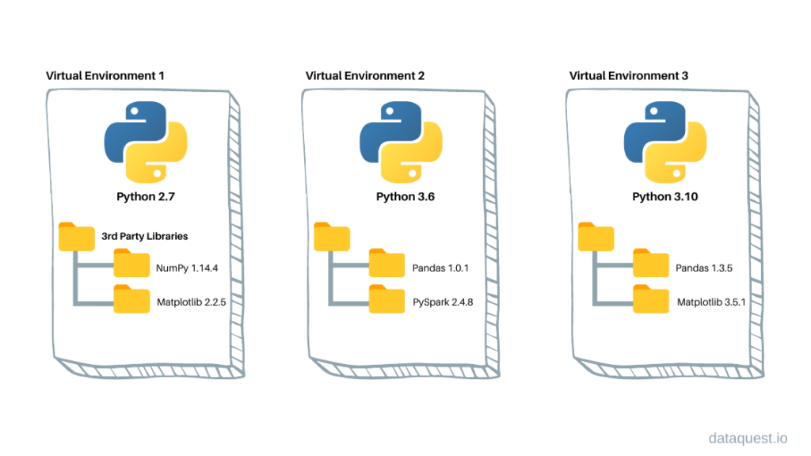

# Virtual Environments 
When we have been running a job on UCloud's *Coder Python*, we have been reinstalling packages for each new run. We can avoid this by using *virtual environments*, which appear as a folder (typically named `.venv`). 

This folder contains a seperate Python installation along with any packages you install inside it. In practice, this allows you to have multiple Python versions and package sets on your system without any conflicts:




In addition to improving your UCloud flow, virtual environments are usually created for each coding project. This gives us better control over the packages and their versions (our code's *dependencies*), ensuring the code is **reproducible**.

## Installing a virtual environment with `venv`
There are several ways to install virtual environments. In this course, we'll be using the Python's built-in library `venv` !

#### Step 1: Change working directory 
In the terminal, navigate to where your code is present:
```bash
cd nlp
```
#### Step 2: Create virtual environment
Type in the terminal:
```bash
python -m venv .venv 
```
```{admonition} Naming your environment
:class: dropdown
In principle, you can call your environment `MyAwesomeEnv`, but the standard practice is to call it `.venv` (or `.env`). This also adheres to GitHub's `.gitignore` template, making it less likely that you will push your environment to Git.
```

#### Step 3: 