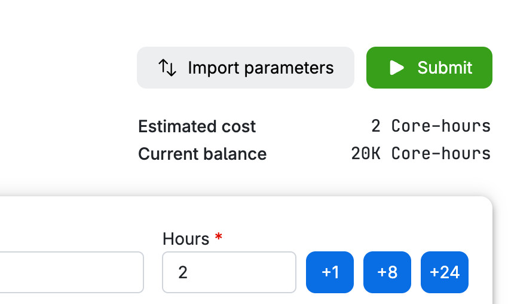

# Step 1. Run a "job" on UCloud

The sections below gives you a step-by-step on how to get started with UCloud. A short summary of this is:
1. Find `Coder Python` on the workspace `NLP-E25`
2. Mount folders `nlp` (created within your own member files) and `resources` (shared drive provided by me)
3. Choose an appropriate machine size for X amount of hours 
4. Submit a job !

## Choose the right workspace
Go to [https://cloud.sdu.dk/app](https://cloud.sdu.dk/app) and start by choosing the workspace `NLP-E25` in the top right corner (if you are not part of it, check instructions on `Brightspace`):

```{figure} ../figures/class_setup/step1-choose-workspace.png
---
height: 150px
name: choose-right-workspace
---
```

### Find Coder Python
Go to "Applications" by clicking the shopping cart 

```{figure} ../figures/class_setup/step1-shopping-cart.png
---
height: 200px
name: shopping_cart
---
````

Find `Coder`:

```{figure} ../figures/class_setup/step1-coder-python.png
---
name: coder-python
---
```

Select `Python` not `Base`. Note also that the version should ALWAYS be `1.103.1`:
```{figure} ../figures/class_setup/step1-select-python-and-version.png
---
name: coder-python-select-version
---
```

```{tip} 
Hit the *star button* to favourite Coder Python *after* selecting the correct version. Then you will more easily be able to find it next time!
```

### Defining your job 
Start by giving your job a name (1). Try to give your job a meaningful name (and avoid using the same name for several jobs).

Select the amount of hours (2) and the machine type (3):
```{figure} ../figures/class_setup/step1-define-job.png
---
name: define job
---
```
```{admonition} Selecting a Machine: Be Mindful!
:class: tip
Selecting the machine type depends on how much memory and power you need. This will vary throughout the course, but as a rule thumb, we'll rarely need anything above `u1-standard-h-16`. If you're only testing the workflow of starting a UCloud run, please select `u1-standard-h-1`! 

As soon as you have selected the hours and machine type, an estimated cost will be shown:


Note the `Current Balance` - while it might seem like we have a lot, please remember that we are sharing these resources across the class, so they will drain fast if you are not mindful. This is not to say that you can't use powerful machines (for many hours even) - just make sure you need them!
```

#### Mounting Folders 
Go down to "select folders to use" and click on "add folder". The folders you choose here will be the ones available to you during the run:
```{figure} ../figures/class_setup/step1-add-folder.png
---
name: add folder
---
```
#### Add the `nlp` folder
Here it becomes important that we are all **streamlined**. 

If it is your first time: ensure you are in your `member files` folder (1), then press `create folder` (2). **Call the folder `nlp`**:
```{figure} ../figures/class_setup/step1-create-folder.png
---
name: create folder
---
```
Press `use` to mount the `nlp folder`:
```{figure} ../figures/class_setup/step1-nlp.png
---
name: use nlp
---
```

#### Adding the `resources` Folder (Class Resources)
Now, add another folder:
```{figure} ../figures/class_setup/step1-add-another-folder.png
---
name: add another folder
---
```
> Note: We may not always need this folder (or it may only be needed optionally), but I suggest always mounting it to make your life easier! It will contain necessary data and models you might want to load.

Here, we want to press the little arrow (1), choose the shared drive `resources` (2) and press `use folder`:
```{figure} ../figures/class_setup/step1-resources.png
---
name: resources folder
---
```

### Template Setup
If your setup looks something like this, you are ready to press the green `submit` button above the estimated costs:
```{figure} ../figures/class_setup/step1-standard.png
---
name: standard setup
---
```

## Open the Interface
When having pressed `submit`, you will be met with a loading screen before seeing `job_name is now running`. Go ahead and press the "open interface" !


```{figure} ../figures/class_setup/step1-interface.png
---
name: interface
---
```

> Note: You can easily extend your job by an hour (+1) or more with the buttons underneath the timer! 