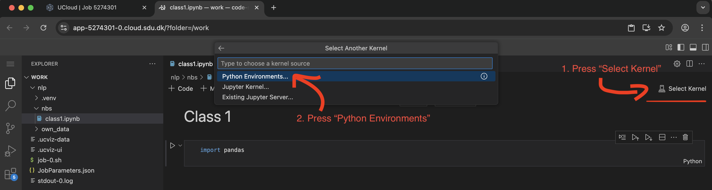
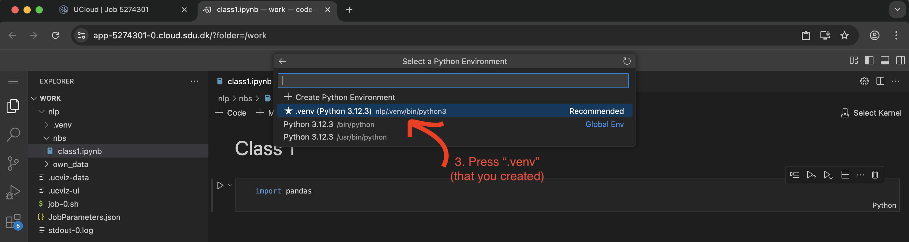
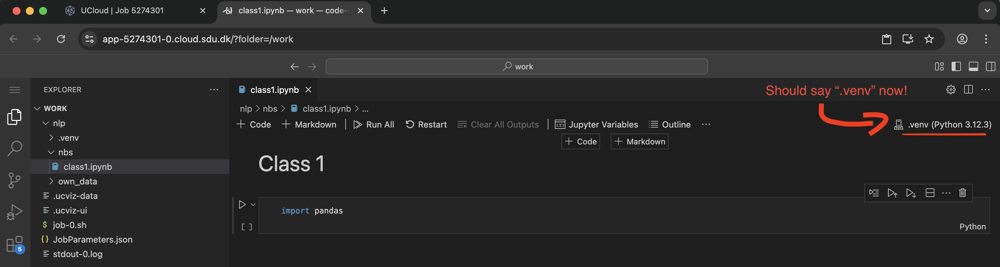

# Activate your venv 
Now that you have installed your `venv`, you can start using it by activating it.  

In the terminal, you can activate your `venv` directly, which is useful for installing packages with `pip` or running `.py` scripts. For Jupyter, we need to select the right `kernel`. See below!


## In the Terminal
If you need to use your `.venv` **in the terminal**:
```bash
source .venv/bin/activate
```
Remember to be located in the same working directory as you created your `.venv`.

```{admonition} Help! I gave my environment a different name!
:class: dropdown, tip
If you ended up calling your `.venv` something else (e.g., `MyAwesomeEnv`), you need to adjust this code slightly: 

```bash
source MyAwesomeEnv/bin/activate
```

In UCloud, it should something look like this:
<pre style="background:#1e1e1e;color:#d4d4d4;padding:8px;border-radius:6px;">
<code>
/work/nlp via 🐍 v3.12.3 (.venv)
[11:21:36] ➜ 
</code>
</pre>

## In Jupyter
:::{warning}
Activating your `.venv` in Jupyter only works if you have followed {ref}`Step 3<venv-step3>` during installation.
:::

To activate your environment for Jupyter, you need to select the kernel in the interface:


Select ".venv":


Should look like this, if it worked:


